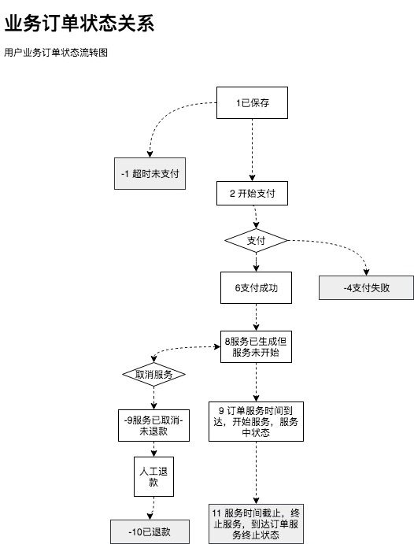

# HiveelPay
## 环境
***
#### 项目结构

```text
HiveelPay: hiveel支付系统
   |--pay-boot (biz-gateway,biz-order,pay-gateway,pay-order) 核心支付业务和支付逻辑
   |--pay-common  通用包
   |--pay-dal     持久层
   |--pay-mgr     hiveelpay的管理系统，可以配置和管理 支付通道，商户，以及产品
   |--pay-shop    通过这个系统可以测试支付配置 和 购买流程以及逻辑
```
#### profiles
* local      本地开发环境
* hiveelco   发布到hiveel.co机器上使用的配置
* prod       发布到生产环境使用的配置
#### Build
* 首先修改 application.yml，里的profile 的环境配置
* 第二步运行下面的命令打包：
```sbtshell
 mvn clean package -Dmaven.test.skip=true
```
#### 发布
##### hiveelpay部署
* hiveel.co环境下部署
  1. 如果当前有应用在运行 请先停止  运行命令``docker stop boot``
  2. 删除 ``/root/apps/boot`` 目录 后在apps目录下创建一个新的 boot目录
  3. WAR包拷贝到 hiveel.co的 ``/root/apps/boot/``目录下
  4. 解压缩 war包： ``unzip pay-boot.war``之后删除 war包 ``rm -rf pay-boot.war``
  5. 运行docker命令启动 应用 
  ``docker run --rm -itd  --name  boot   -p 3020:8080 -v /tmp/:/tmp/  -v /etc/localtime:/etc/localtime  -v $PWD:/usr/local/tomcat/webapps/ROOT/  --network mynetwork   tomcat:9.0.8-jre10``
  6. 日志目录： ``tail -f /tmp/hiveelpay.XXXX-XX-XX.log``
##### 订单状态




#### 补单SQL
* 补单的时候要把对应的值改掉
```sql
----- // 补业务订单
insert into pay.t_biz_order (customerId, bizOrderNo, productId, productName, docId, amount, commissionAmount, productType, serviceLength,
        serviceLengthUnit, orderStatus, firstBillDate, payAmount, currency, mchId, channelId, paySuccessTime, remark, invalidBizOrderNo) value(
        'IRIS','IRIS001','Pf2f81a39eda74785b81a39eda7c785f3','Instant Sell','A297f5C3C40',599,'3000','TRADE_IN',1,4,11,'2018-10-08 18:00:00',599,'USD',10000002,'H_ONCE','2018-10-08 18:00:00','IRIS saved',null );

----- // 更新 预约单 的 bizOrderNo
update  pay.t_appointment_doc set bizOrderNo = 'IRIS001' where id>0 and appointmentId = 'A297f5C3C40';

----- // 插入 服务时间
insert into pay.t_customer_valid_services (
 customerId, serviceId, productId, bizOrderNo, serviceName, serviceType, serviceStatus, startTime, endTime
)value
(
  'IRIS','IRIS001','Pf2f81a39eda74785b81a39eda7c785f3','IRIS001','Instant Sell',34,0,'2018-10-10 11:00:00','2018-10-11 11:00:00'
);

----- // 插入支付订单
insert into  pay.t_pay_order(
 PayOrderId,MchId,MchOrderNo,ChannelId,Amount,Currency,Status,ClientIp,Device,Subject,Body,Extra,ChannelMchId,ChannelOrderNo ,Param1,Param2,NotifyUrl,PaySuccTime
)value(
 'IRIS001','10000002','IRIS001','H_ONCE',599,'USD',2,'127.0.0.1','WEB','Instant Sell','IRIS',null,'H_ONCE10000002','IRIS001','2623','IRIS001','http://',1537147026135
);
```